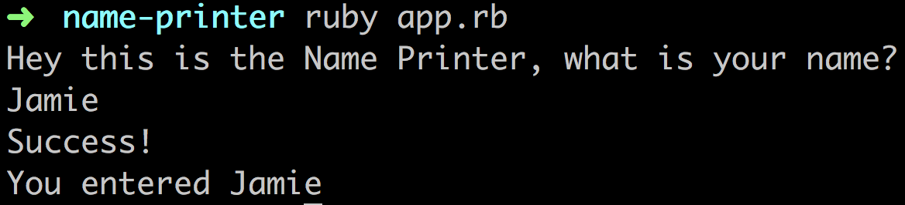

# Name Checker

This app is a simple Ruby terminal app to show some documentation basics. The app itself takes your name and prints it within the terminal.

### Features

- Submit your own name and have it printed in the terminal back to you

### Support Ruby Versions

All versions supported

### Usage

1. Start the Ruby terminal app

```sh
$ ruby app.rb
```

2. Give user input

Wait for prompt and enter your name.

3. Read results

Output should look similar to this:



### Contributing

If you are considering contributing that would be welcome. All app logic is in `app.rb`. Please submit a Pull Request when your contribution is ready. 
